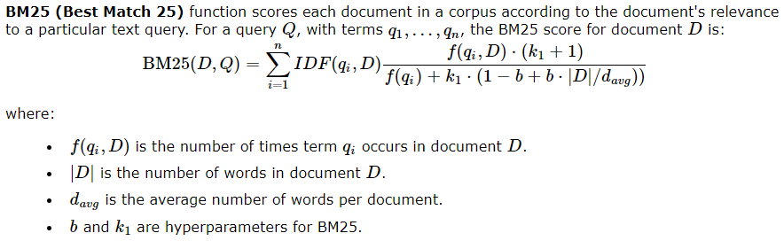
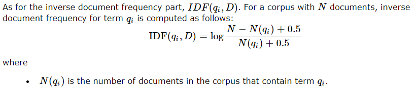
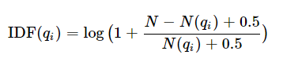

# lyric retriever

Hosted on AWS
http://lyricretriever-env.eba-ftppkhi3.us-east-2.elasticbeanstalk.com/

## How to setup the environment to execute the code
1. Clone this repository
2. In your terminal, navigate to within this repository's folder. (e.g. with `cd ~/lyric-retriever`)

## How to run FLASK webapp
1. Ensure you're in `~/lyric-retriever`
2. Create a python virtual environment with `python3 -m venv venv`
3. Enter the python virtual environment with `. venv/Scripts/activate` on Windows or `. venv/bin/activate` on Mac/Linux
4. Install the required python modules with `pip install -r requirements.txt`
5. Start the FLASK server with `flask run`
6. This might take a while to load...
7. Running on http://127.0.0.1:5000
8. Exit the python virtual environment with `deactivate`

## How to run just the algorithm (terminal interface)
1. Execute the command `python3 python/test.py`. It will prompt you to enter a query statement that will be searched within our songs collection (data/azlyrics-csv).

## BM25 Equation
The following is the core algorithm that we decided to follow in order to implement docment ranking amongs our song collection.

### IDF Equation

### IDF Equation (Accounts for negatives)
This IDF equation accounts for negative IDFs by adding 1 to all IDFs. \

